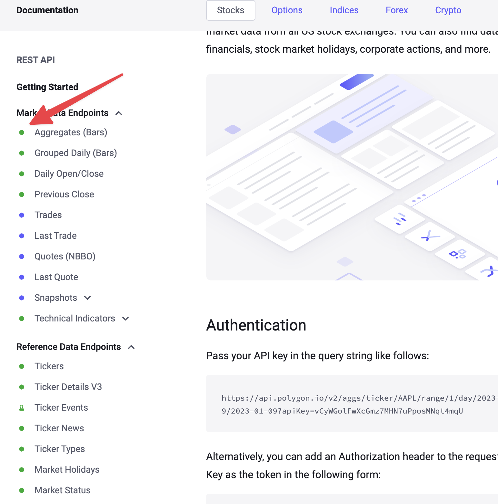

# How to write an Algorithmic Trading Bot in Python with Polygon.io

Algorithmic trading, or *algotrading*, has become increasingly accessible to individual developers,  traders, economics students. In face, with a little bit of Python knowledge, anyone can write a simple algotrading bot using  historical market data provided by [Polygon.io](https://polygon.io) Let me show you how. 

This blog will guide you some of the most common requirements you may encounter when building your own algotrading process, and how you could combine these into a simple trading bot. All you need to create the trading bot is a [free Basic plan](https://polygon.io/pricing?utm_campaign=quintontradingbot) to access  historical data via the basic plan.  

## Set Up Your Polygon.io Account
- Sign up on the [Polygon.io](https://polygon.io/pricing?utm_campaign=quintontradingbot) website and select the basic plan. After registration, you'll receive an API key, or you can obtain this from within the dashboard at any time.
- Ensure you have Python installed, and  install the necessary libraries

```bash
pip install polygon-api-client pandas numpy requests
```
## Fetch historical data
Historical data is available in the basic plan. Polygon.io makes it super easy to see what is available for free and what requires a paid subscription. Just look for the green dots next to the [API endpoints in the documentation](https://polygon.io/docs/stocks/getting-started) for anything that is included in the basic plan.


To get started, let’s write a quick function fetch Apple ticker information for the past 30 days.

```python
from datetime import datetime, timedelta
from polygon import RESTClient
from polygon.exceptions import BadResponse, AuthError
import pandas as pd
import numpy as np
import time


#set up polygon client
API_KEY = 'YOUR-API-KEY-HERE'
client = RESTClient(API_KEY)


#example historical data
def get_historical_data(symbol, start_date, end_date):
    return client.get_aggs(ticker=symbol, multiplier=1, timespan="day", 
                           from_=start_date, to=end_date)


end_date = datetime.now()
start_date = end_date - timedelta(days=30)
historical_data = get_historical_data('AAPL', start_date.strftime('%Y-%m-%d'), end_date.strftime('%Y-%m-%d'))
for bar in historical_data:
    print(f"Date: {bar.timestamp}, Close: ${bar.close}")

```

## Retrieve real time data
Polygon also supports retrieving real time data. For this, you will need a paid subscription. I’ve included the code for reference, but you don’t need anything more than the Basic (free) plan to implement the rest of the tradebot.  As you can see from the code below, and the previous example, working with the APIs is very simple, and responses are lightning fast. 

```python
 # Example get real time data for last trade. Requires upgraded account.
def get_real_time_data(symbol):
    return client.get_last_trade(symbol)

data = get_real_time_data('AAPL')
print(f"Last trade price for AAPL: ${data.price}")
```

## Implementing a simple trading strategy
The next thing you are going to need is a trading strategy.  Polygon.io doesn’t provide trading strategy calculations. You have the flexibility to include whatever strategy makes the most sense for your use case. For this example, I’m going to use [Relative Strength Index \(RSI\)](https://www.stockmarketguides.com/article/rsi-indicator) and write a quick implementation using the historical data we fetched previously.

```python
import numpy as np
import pandas as pd

def calculate_rsi(data, window=14):
    df = pd.DataFrame([bar.__dict__ for bar in data])
    df['close'] = df['close'].astype(float)
    delta = df['close'].diff()
    gain = (delta.where(delta > 0, 0)).rolling(window=window).mean()
    loss = (-delta.where(delta < 0, 0)).rolling(window=window).mean()
    rs = gain / loss
    return 100 - (100 / (1 + rs)).iloc[-1]

# Example usage
rsi = calculate_rsi(historical_data)
print(f"Current RSI: {rsi}")

```

## Placing trades
If this was a real trading bot, you would obviously need a way to place a trade. For this example, we'll use a mock function to simulate placing orders. In a real scenario, you would integrate with a brokerage API. TradingView provides a [comprehensive list of brokers](https://www.tradingview.com/support/solutions/43000479307-what-brokers-can-i-trade-through-on-tradingview/) you could use, if you don’t have one already. 

```python
##mock broker stub for placing trades
def place_order(symbol, side, quantity):
    #  Replace with actual brokerage API call.
    print(f"Placing {side} order for {quantity} shares of {symbol}")

# Example usage
place_order('AAPL', 'buy', 10)
```

## Creating the Trading Bot
Now that we have covered all the main requirements of a trading bot, it’s time to pull everything together.  The bot fetches historical data every 5 times and checks the trading strategy for a determination of whether you should buy or sell.  Obviously, in a real-world scenario you want to fetch real-time data. You can achieve this using the sample snippet earlier in this tutorial and a paid subscription plan. 

```python
#our super simple trading bot
def simple_trading_bot(symbol):
    while True:
        end_date = datetime.now()
        start_date = end_date - timedelta(days=30)
        historical_data = get_historical_data(symbol, start_date.strftime('%Y-%m-%d'), end_date.strftime('%Y-%m-%d'))
        
        rsi = calculate_rsi(historical_data)
        print(f"Current RSI for {symbol}: {rsi}")

        if rsi < 30:
            place_order(symbol, 'buy', 10)
        elif rsi > 70:
            place_order(symbol, 'sell', 10)

        time.sleep(300)  # Wait for 5 minutes before checking again

# Example usage
simple_trading_bot('AAPL')

```

## Adding error handling and rate limiting
Our bot works fine, but a best practice when working with any API is to ensure that implement sufficient error handling and use API calls efficiently. For example, let’s say our bot was using real-time data and making real trades, we want to ensure it’s operating properly but adding retry logic and some sort of exponential backoff to avoid rate limits.

```python
def get_data_with_retry(symbol, retries=3):
    for attempt in range(retries):
        try:
            return get_real_time_data(symbol)
        except AuthError as e:
            print(f"Could not authenticate: {e}")
            if attempt == retries - 1:
                raise
            time.sleep(2 ** attempt)  # Exponential backoff
        except BadResponse as e:
            print(f"Error fetching data: {e}")
            if attempt == retries - 1:
                raise
            time.sleep(2 ** attempt)  # Exponential backoff
        

```

Your final, real-time ready bot would look something like this:

```python
# Requires a paid Polygon.io subscription to retrieve data in real-time
def realtime_trading_bot(symbol):
    while True:
        end_date = datetime.now()
        start_date = end_date - timedelta(days=30)
        rt_data = get_data_with_retry(symbol=symbol)
        
        rsi = calculate_rsi(historical_data)
        print(f"Realtime: Current RSI for {symbol}: {rsi}")

        if rsi < 30:
            place_order(symbol, 'buy', 10)
        elif rsi > 70:
            place_order(symbol, 'sell', 10)

        time.sleep(300)  # Wait for 5 minutes before checking again

# Example usage
realtime_trading_bot('AAPL')

```

## Conclusion
This tutorial showed you how to write a basic algotrading bot using [Polygon.io's APIs](https://polygon.io/utm_campaign=quintontradingbot),  the free Basic plan, Python  client library and some historical ticker data. Remember that this is a simplified example for educational purposes only. Real-world trading systems require more sophisticated strategies, rigorous testing, and careful risk management. 

For more advanced features, including access to real-time data and higher data limits, some of which I touched upon in this post,  you will need to upgrade your plan. My best advice is start and experiment with historical data to prove out your logic, and when you are ready, upgrading is available at any time. 

For more examples, check out the [Python client library on Github](https://github.com/polygon-io/client-python/tree/master), and leave a few stars if you find it helpful. 
